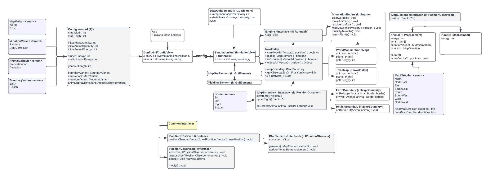

# Darwin Simulator

This repository contains the code for the Darwin Simulator, a JavaFx application developed as part of a course in Object Oriented Programming.

## Demo

## Overview

The Darwin Simulator is a JavaFx application that simulates the evolution of species over time. The user can play with different organism's traits and behaviors and observe how they interact and evolve in their environment.

## Collaborators

This project was developed by:
- Jakub Kędra: [@xramzesx](https://github.com/xramzesx)
- Michał Skałka: [@skalakid](https://github.com/skalakid)

## Assumptions

All requirements and assumptions regarding the project are stored in the [`/requirements/`](https://github.com/xramzesx/oolab-darwin-simulator/tree/main/requirements) directory.

## Features & variants

We were assigned to implement a program with the sequence "2112", but despite this, we decided to implement every mentioned variant.

## Technologies

The Darwin Simulator was developed using the following technologies:

- Java
- Gradle.bat
- JavaFx

## UML
There is UML scheme we base on ([link](https://lucid.app/lucidchart/aa5dbfaa-683b-43c8-b56f-89e17ddd2d6b/edit?invitationId=inv_dce27aae-d568-4140-8ef6-784957ea1f06) to original):

